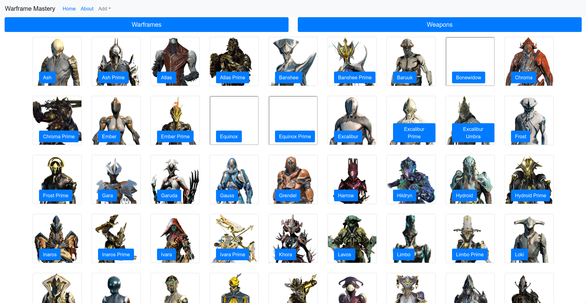
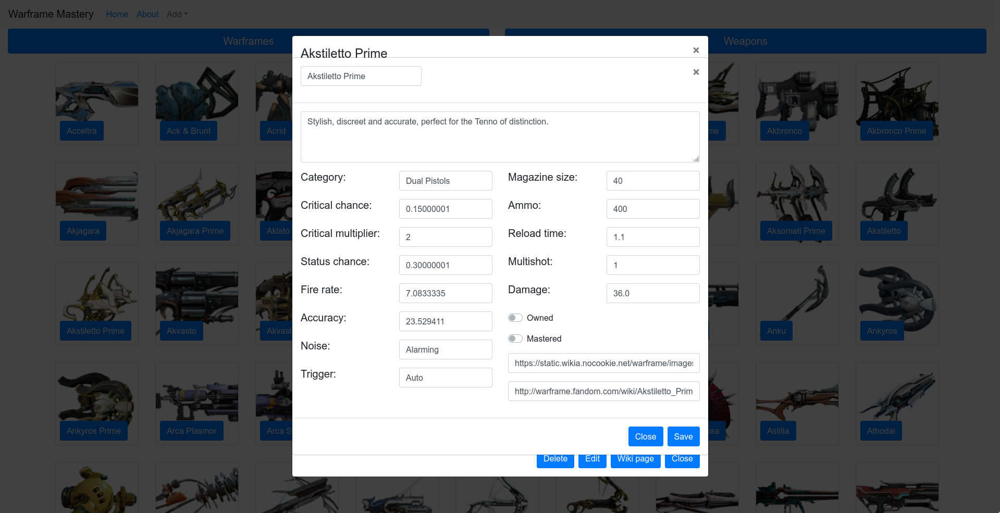
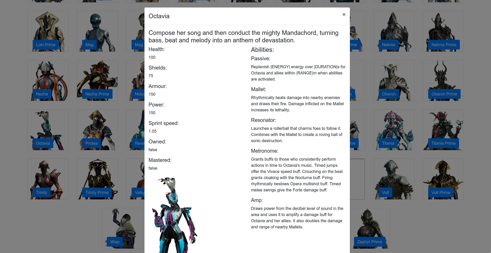

[![Contributors][contributors-shield]][contributors-url]
[![Forks][forks-shield]][forks-url]
[![Stargazers][stars-shield]][stars-url]
[![Issues][issues-shield]][issues-url]
[![LinkedIn][linkedin-shield]][linkedin-url]


<!-- PROJECT LOGO -->
<br />
<p align="center">


  <h3 align="center">Wfmastery</h3>

  <p align="center">
    A project made for my frontend course.  
    <br />
    <a href="https://github.com/KacperKurz/wfmastery"><strong>Explore the docs »</strong></a>
    <br />
    <br />
    <a href="https://github.com/KacperKurz/wfmastery/issues">Report Bug</a>
    ·
    <a href="https://github.com/KacperKurz/wfmastery/issues">Request Feature</a>
  </p>
</p>


<!-- TABLE OF CONTENTS -->
<details open="open">
  <summary><h2 style="display: inline-block">Table of Contents</h2></summary>
  <ol>
    <li>
      <a href="#about-the-project">About The Project</a>
      <ul>
        <li><a href="#built-with">Built With</a></li>
      </ul>
    </li>
    <li>
      <a href="#getting-started">Getting Started</a>
      <ul>
        <li><a href="#prerequisites">Prerequisites</a></li>
        <li><a href="#installation">Installation</a></li>
      </ul>
    </li>
    <li><a href="#usage">Usage</a></li>
    <li><a href="#contact">Contact</a></li>
    <li><a href="#acknowledgements">Acknowledgements</a></li>
  </ol>
</details>


<!-- ABOUT THE PROJECT -->
## About The Project








### Built With

* [React](https://reactjs.org/)
* [Redux](https://redux.js.org/)
* [Node](https://nodejs.org/en/)
* [Bootstrap](https://getbootstrap.com/)


<!-- GETTING STARTED -->
## Getting Started

To get a local copy up and running follow these simple steps.

### Installation

1. Clone the repo
   ```sh
   git clone https://github.com/KacperKurz/wfmastery.git
   ```
2. Install NPM packages
   ```sh
   npm install
   ```


<!-- USAGE EXAMPLES -->
## Usage

Run with:
```shell script
npm start
```

You can choose between Warframes or Weapons. Both buttons display list of selected entities.
Click on a button with name of Warframe/Weapon You are interested in and detailed view will show up.
While in detailed view You can:
* Delete
* Edit
* Visit wiki page
* Close detailed view

While in edit view you can edit every detail including whether the Warframe/Weapon is owned or mastered.
(Any changes made in edit view are **not** saved and will disappear.)

Additionally, You can add new Warframe/Weapon. Upon selecting add→Warframe/Weapon a view similar to edit view will show up.


<!-- CONTACT -->
## Contact

Kacper Kurz - kacperkurz@protonmail.com

Project Link: [https://github.com/KacperKurz/wfmastery](https://github.com/KacperKurz/wfmastery)


<!-- ACKNOWLEDGEMENTS -->
## Acknowledgements

* [WarframeStat.us](https://docs.warframestat.us/)


<!-- MARKDOWN LINKS & IMAGES -->
<!-- https://www.markdownguide.org/basic-syntax/#reference-style-links -->
[contributors-shield]: https://img.shields.io/github/contributors/KacperKurz/wfmastery.svg?style=for-the-badge
[contributors-url]: https://github.com/KacperKurz/wfmastery/graphs/contributors
[forks-shield]: https://img.shields.io/github/forks/KacperKurz/wfmastery.svg?style=for-the-badge
[forks-url]: https://github.com/KacperKurz/wfmastery/network/members
[stars-shield]: https://img.shields.io/github/stars/KacperKurz/wfmastery.svg?style=for-the-badge
[stars-url]: https://github.com/KacperKurz/wfmastery/stargazers
[issues-shield]: https://img.shields.io/github/issues/KacperKurz/wfmastery.svg?style=for-the-badge
[issues-url]: https://github.com/KacperKurz/wfmastery/issues
[linkedin-shield]: https://img.shields.io/badge/-LinkedIn-black.svg?style=for-the-badge&logo=linkedin&colorB=555
[linkedin-url]: https://linkedin.com/in/kacper-kurz-175707199
